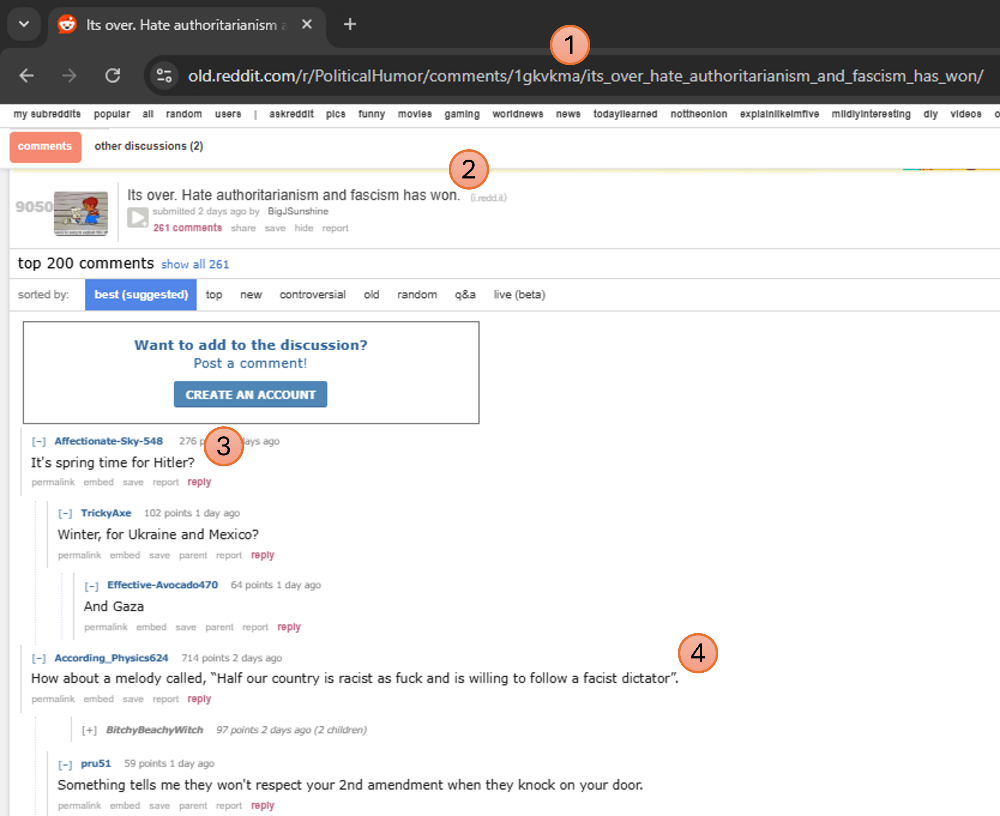

# Foobar

Foobar is a Python library for dealing with word pluralization.

## Installation

Use the package manager [pip](https://pip.pypa.io/en/stable/) to install foobar.

```bash
pip install foobar
```




